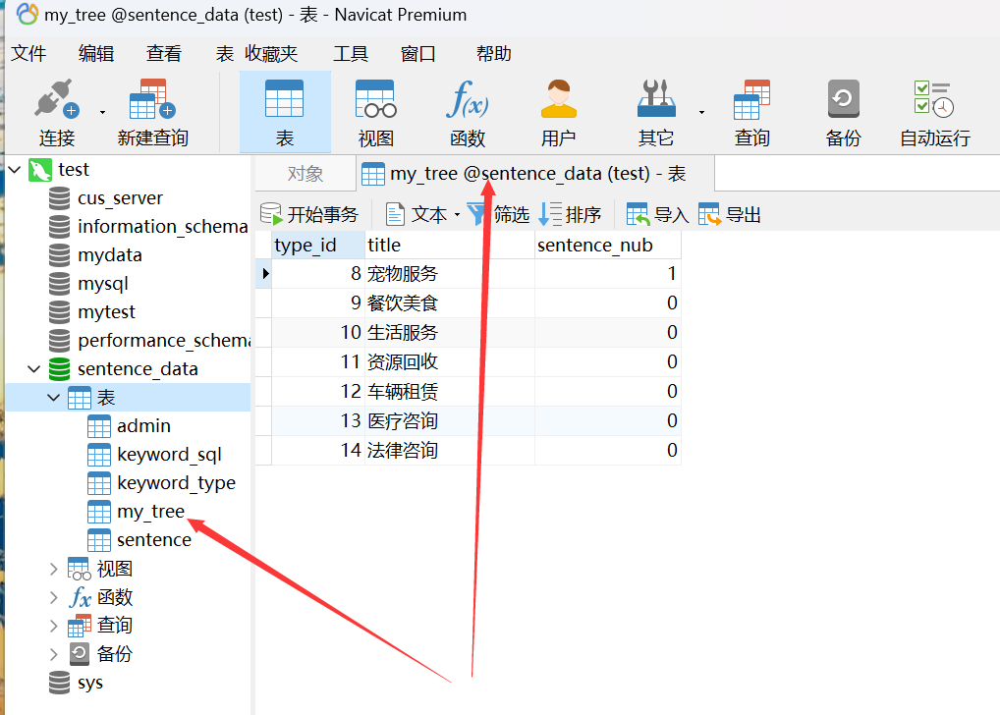

# myJecs
项目说明：
* 该项目是基于easyAi引擎的JAVA高性能，低成本，轻量级智能客服助手。可与用户自动对话，自动捕捉订单信息，分辨用户需求，自动生成订单，轻量级的智能客服助手。
* 为电商类，咨询类，平台类服务应用(web/小程序/APP/JAVA)，提供高性能的自动智能客服支持。
* 本项目是依赖easyAi引擎衍生应用，以easyAi高性能廉价部署的思路，可在cpu上无压力高效运行，开包即用。功能持续扩展，敬请期待。
* 本项目永久免费商用，如果能对您生产和学习有帮助请给作者一个star，这会非常鼓励我。
* 若有想扩充的功能或技术交流请进群提意见，技术交流群：222475213，561433236（满）
* 项目依赖easyAi下载链接：https://gitee.com/ldp_dpsmax/easyAi
## 详细视频教程地址：
* 视频教程地址：https://www.bilibili.com/video/BV1W7411J7zr?p=1
### myJecs分类配置及标注后台
* 登录页面

* 配置业务分类及分类订单必要关键信息

* 对分类业务填写训练样本并标注关键信息

### myJecs智能客服基本流程演示
* 用户第一次进行输入表达自己的想法

* 用户接收到myJecs的反问，进一步补充的自己的想法

* 用户第二次输入信息依然不满足后台14分类法律咨询的订单关键信息要求，继续补充信息，最终完成订单信息补充生成订单。

### 快速开始
* 将/testModel/**，里面的模型文件，一一对应配置类里字段，创建文件夹目录，让这五个模型可以被系统读取到。

* /testData/sentence_data.sql，建立本地数据库，并执行此带有测试数据的mySQl数据库脚本到本地数据库。
* 修改application.properties 本地数据库配置，指向执行上一步脚本所执行的数据库
* 下载easyAi-1.1.4依赖并打包到本地maven仓库：https://gitee.com/ldp_dpsmax/easyAi
* 启动应用，访问127.0.0.1:8080/ai/talk，直接输入语句字符串，不要使用JSON格式
* 目前测试数据支持的语言类型保存在数据库表如下位置，请自行查看

* 部署管理后台，将项目目录/wlTalk/**部署到web容器根目录下，启动后访问127.0.0.1:8080/wlTalk，默认超管端账号：admin，密码:admin
* 具体使用的详细教程链接：https://www.bilibili.com/video/BV1W7411J7zr?p=1
### API 说明:
``` java
    package com.wlld.myjecs.config.Config;
    //配置文件的模型文件保存地址，用户可自定义输入，若该地址无文件则自动进入训练模块
    //词向量模型
    public static final String Word2VecModelUrl = "D:\\testModel\\end.json";
    //语义分辨模型
    public static final String SentenceModelUrl = "D:\\testModel\\sentence.json";
    //关键词敏感性嗅探模型
    public static final String onlyKeyWord = "D:\\testModel\\preKeyWord.json";
    //关键词查找模型
    public static final String KeyWordModelUrl = "D:\\testModel\\myKeyWord.json";
    //关键词索引模型
    public static final String keyWordIndex = "D:\\testModel\\keyWordIndex.json";
    //数据库表映射层
    package com.wlld.myjecs.mapper.SqlMapper
```
## 部署注意
* 因为脚本内的测试数据是直接从外部数据库洗进来的，不是正常添加。所以脚本内的测试数据在超管端显示数量都为0。
* 静态页面资源部署的时候，其静态资源路径必须在“/wlTalk/**”下，例如：127.0.0.1/wlTalk/index.html，否则无法正常跳转页面，请注意！
* 因为本人非常不擅长写前端页面，本管理系统核心也不是前端页面，所以页面目的只是可用，设计看起来非常粗糙。如果有想加入easyAi衍生应用项目myJecs，擅长前端的小伙伴，可私信联系我。
* 前端页面UI组件直接使用的bootstrap v3.0，js框架使用的是JQUERY，主要是因为作者不会vue。
* 管理端超管账号:admin，密码:admin，超管账号密码不在数据库，在com.wlld.myjecs.config.Config;请自行修改。
* 在com.wlld.myjecs.config.Config;中starModel = true;当它为true的时候，服务启动会自动加载模型或更新训练，当用户想快速启动管理端，不希望进行此耗时行为时将其改为 false,其默认为true。
### 演示数据sql脚本及静态资源位置
* sql脚本（包含用于测试的数据）位置：/testData/sentence_data.sql
* sql脚本（仅结构无测试数据）位置：/testData/sentence.sql
* 对应模型文件位置：/testModel/**
* myJesc前端页面资源位置：/wlTalk/**
### 模型说明
* 词向量嵌入模型：该模型负责记录样本输入过的字，注意词向量模型无需频繁更新，当一句话中只有少量非关键字不认识的时候，不影响输出结果，所以只有当样本量已经比上次更新该模型时增量超出40%以上的时候，才建议更新。而且该模型也是训练耗时最久的模型，更新一次按小时为单位，所以慎重频繁更新(如果核心是线程撕裂者当我没说)！
* 语义分辨模型：该模型负责对语句进行分类，训练完毕可在Config中开启样本测试（selfTest = true 默认是false不开启），开启后将在服务启动时进行数据库内的样本数据自检，如果对样本测试结果不满意，可删除该模型文件，进行重新训练。该模型训练时间通常在半个小时以内（具体看数据量），该模型只有样本增量超过20%以上的时候才值得更新。
* 关键词敏感性嗅探：该模型针对指定关键词种类是否存在进行判定，该模型更新时间通常小于两分钟，可以频繁更新。如果对关键词判定是否存在结果不满意，可以调整参数后，删除模型重新训练，也可以接收任意数量的增量样本后，删除重新更新。
* 关键词查找模型：该模型负责判定存在某种类关键词后，抓取该种类关键词。该模型更新速度很快，通常小于一分钟，如果对抓取不满意，可以删除后模型重新训练。也可以接收任意数量的增量样本后，删除重新更新。
* 关键词索引模型：记录所有关键词，负责只有当用户直接输入关键词本身的时候才会抓取，速度飞快，数秒就可完成更新，只是作为一种辅助补充。
* 所有模型更新只需要删除指定路径下的模型文件，服务重启后，服务自动更新缺失的模型文件。
* 词向量嵌入模型如果重新更新，所有模型都需重新更新，因为所有模型几乎都依赖词向量模型。而除了词向量以外的其他模型更新，只需删除它对应的文件模型，重启后就会只更新它自身即可。
### 作者太穷了，快没饭吃了！如果该项目对你有用，请可怜一下作者的劳动力支持开源，请作者吃一顿早饭就好！给作者持续更新easyAi引擎，同时封装更多依赖easyAi的常用应用提供动力！为大家低成本部署AI应用添砖加瓦！万谢!好心人！

### 依赖
项目依赖：
* springboot-2.5.6
* easyAi-1.1.4：https://gitee.com/ldp_dpsmax/easyAi
### 常见抛错
* 表中的模板语句量少于101：Template statement must be greater than 101
* 语句类别id不可以等于0：type id Cannot be 0

